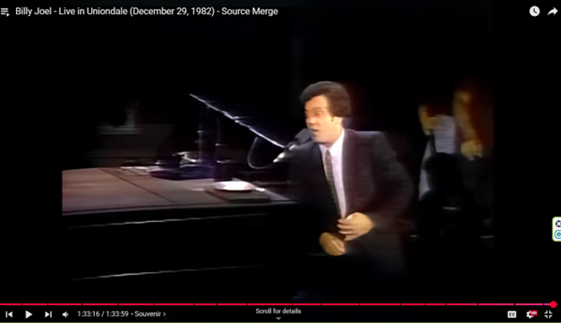

# Logic Evaluation Engine (LEE)

## Some Inspiration

> **"Happy New Year Long Island. And don’t take any shit from anybody!"**  
> — Billy Joel, [Live in Uniondale (December 29, 1982)](https://www.youtube.com/watch?v=wDEvqyiRpzE&t=5596s)

This project, like Billy said, is about doing the work right — and not taking any crap from anyone: not when they insist on broken logic, bad data, bloated design; and especially not when they think they can talk any shit whatsoever in your presence. You may let them do it; but they'll know you've noted it.

## Executive Summary
The **Logic Evaluation Engine (LEE)** is a next-generation inference system built on **phase-geometry logic**. It delivers deterministic, reproducible, and measurable reasoning performance — across Medical, Legal, and Defense domains — without the statistical drift or opaque heuristics common in competing engines.

Where other inference tools produce “best guesses,” LEE generates **provable reasoning states** with conservation-law properties, making it uniquely suited for high-stakes decisions where accuracy, transparency, and stability matter.

---

> **🧠 Research Collaboration Opportunity — Neuroscience**  
> LEE’s phase-geometry engine has produced **toroidal low–high dimensional manifolds** closely matching cortical grid-cell activity seen in *Nature* (2011, 2024) — despite being developed independently of neuroscience models. Its **counterfactual multi-object testing** enables hypothesis generation that could point to *as-yet unobserved* cortical configurations.  
> [Read the full call for neuroscience collaboration →](#-call-for-research-collaboration--neuroscience)
>
>  A graphical preview here →
> 
> 

---

## Why LEE Now
Medical diagnostics, legal analysis, and defense intelligence all face the same core challenge:  
**How do you ensure that your reasoning engine is correct, stable, and explainable — every time, under all conditions?**

- Existing category leaders rely on probabilistic or heuristic methods prone to drift.
- Regulatory and operational environments increasingly demand **auditable reasoning**.
- The LEE codebase is **operational today**, grant-ready, and backed by demonstrable metrics from real runs.

---

## Core Innovations
- **Basis5 Phase Geometry** — maps material implication truth tables into a rotational phase space.
- **Logical Conservation Laws** — including the *Logical Bianchi Identity*, enabling residual checks on reasoning stability.
- **Quantitative Metrics** — *StressIndex*, *Resistance*, and *Winding* for live “health checks” of reasoning.
- **Provenance Logging** — full trace of every reasoning step for audit and legal defensibility.
- **Cross-Domain Transferability** — same engine works across medical, legal, and defense without architectural change.

---

## Vertical Applications

### Medical Diagnostics
- Detects **manifold distortions** in reasoning chains that signal diagnostic instability before it surfaces in outputs.
- Flags contradictory evidence integration — even when masked by statistical smoothing in other systems.
- Integration: API-level drop-in alongside existing diagnostic inference systems.

### Legal Reasoning
- Quantifies **case health** by measuring contradiction currents and logical manifold strain.
- Produces complete **provenance chains** — enabling airtight legal audits.
- Detects adversarial reasoning attempts in litigation or compliance review.

### Defense & Intelligence
- Maintains reasoning stability under **adversarial contradiction injection**.
- Evaluates reliability of intelligence fusion without requiring source model disclosure.
- Integrates with decision-support platforms to deliver **provable reasoning state** outputs.

---

## Competitive Positioning
| Domain      | Typical Competitors                           | LEE Advantage |
|-------------|-----------------------------------------------|---------------|
| Medical     | Bayesian nets, statistical classifiers        | Deterministic conservation laws, distortion metrics |
| Legal       | Rule-based expert systems, NLP opinion miners | Provable contradiction mapping, provenance integrity |
| Defense     | Probabilistic fusion engines, heuristic DSS   | Adversarial-resistant phase-geometry reasoning |

LEE does not replace vertical-specific tooling — it **sits alongside**, evaluates, and can outperform in both stability and auditability.

---

## Maturity & Funding Readiness
- **Status:** Fully functional engine, metrics, provenance, automated tests.
- **Grant-Ready:** Public GitHub release (`v3.1-pre-grant` [See Release v3.1-pre-grant →](https://github.com/KILGORETROUT111/logic-evaluation-engine/releases/tag/v3.1-pre-grant)) includes code, docs, and reproducible runs.
- **Next Milestones (6–12 months):**
  1. Time-weighted StressIndex for temporal instability detection.
  2. Expanded manifold distortion analysis.
  3. Field pilots in medical, legal, and defense environments.
  
---

## Technical Overview (Basis5)
- **Primitives:** `Alive`, `Jam`, `Mem`, `Vac` — derived from material implication truth tables.
- **Geometry:** Phase-rotation mapping enables detection of conserved and distorted states.
- **Operators:** Covariant in composition, enabling decomposition into disparity and recomposition to full state.
- **Metrics:**  
  - **StressIndex** — strain in logical flow.  
  - **Resistance** — persistence of strain over cycles.  
  - **Winding** — directional characteristics of reasoning flow.  
  - **Bianchi Residual** — conservation of contradiction current.

---

## 📢 Call for Research Collaboration — Neuroscience
LEE’s phase-geometry inference engine has, in multiple independent runs, produced **toroidal low–high dimensional manifold activity** strikingly consistent with cortical grid-cell dynamics reported in *Nature* (2011, 2024).  
Unlike purely biologically grounded models, LEE was developed independently — yet its **compucognitive architecture** naturally generates manifold structures both **within and beyond known cortical constraints**.

Through its **counterfactual multi-object testing** (patients, cases, or plug-in domains), LEE can probe “what-if” reasoning paths in ways that align with hypothesis generation in experimental neuroscience.  
This raises a compelling possibility: LEE could serve as a **computational discovery tool**, suggesting novel cortical configurations that may later be tested in vivo or in silico.

We invite collaboration with systems neuroscientists, computational modelers, and cognitive architecture researchers to explore:
- How LEE’s emergent manifolds map to cortical activity patterns
- Whether beyond-topology configurations offer new experimental targets
- How counterfactual manifold analysis could accelerate cortical hypothesis formation

**If your research investigates brain-state manifolds or neural dynamics, LEE may offer a new computational lens to expand your discovery space.**

---

## Next Steps
- Extend vertical partnerships for domain-specific pilots.
- Secure funding to scale compute, optimize engine parameters, and expand metric suite.
- Broaden outreach to regulatory and compliance bodies for early adoption.

---

**Author:** William Alexander Patterson  
**License:** [GNU General Public License version 3](https://opensource.org/license/gpl-3-0)

