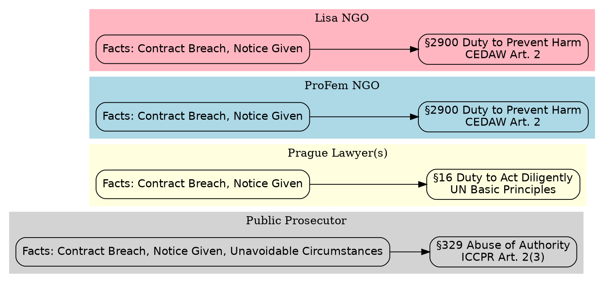

# Case Matrix: Public Prosecutor, Prague Lawyer(s), ProFem NGO, “Lisa” NGO

This matrix outlines the logical and legal relationships between key actors in the case, mapped against relevant statutes and obligations.

## Actors and Applicable Statutes

| Actor                | National Statutes Violated                          | International Statutes Violated                               | Notes on Evidence and Breach                                           |
|----------------------|-----------------------------------------------------|----------------------------------------------------------------|-------------------------------------------------------------------------|
| **Public Prosecutor**| Criminal Code §329 (Abuse of Authority)              | ICCPR Art. 2(3) (Right to Effective Remedy)                    | Proof of receipt and return of case file on form grounds despite substantive merits — constitutes willful obstruction. |
| **Prague Lawyer(s)** | Advocacy Act §16 (Duty to Act Diligently)             | UN Basic Principles on the Role of Lawyers, Principle 14       | Proof of reading and returning the case file without pursuing remedies. |
| **ProFem NGO**       | Civil Code §2900 (Duty to Prevent Harm)               | CEDAW Art. 2, UN ECOSOC Resolution 1996/31 (NGO accountability) | UN-listed NGO; engaged, aware of facts, no substantive action taken.    |
| **“Lisa” NGO**       | Civil Code §2900 (Duty to Prevent Harm)               | CEDAW Art. 2                                                    | Received case materials; no follow-up; no safeguarding assurances.      |

## Logical Representation

```prolog
% Facts
ContractBreach(public_prosecutor).
NoticeGiven(public_prosecutor).
UnavoidableCircumstances(public_prosecutor).

ContractBreach(prague_lawyer).
NoticeGiven(prague_lawyer).

ContractBreach(proFem).
NoticeGiven(proFem).

ContractBreach(lisa_ngo).
NoticeGiven(lisa_ngo).

% Axioms
(ContractBreach(X) ∧ ¬NoticeGiven(X)) → PenaltyApplies(X).
(NoticeGiven(X) ∧ MitigatingCircumstances(X)) → ¬PenaltyApplies(X).
UnavoidableCircumstances(X) → MitigatingCircumstances(X).
```

## Graph Representation



---
*This matrix will be updated as further evidence or statutory references are identified.*
