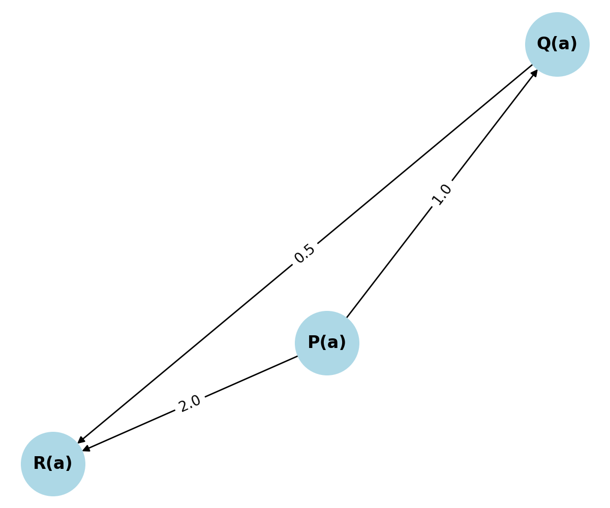

# Phase Geometry (Basis5)

This page documents the **exact discrete geometry** used by LEE 3.0.

## Phases

| Phase | Angle | Unit Vector |
|------:|:-----:|:-----------:|
| ALIVE |  0°   |  (1, 0)     |
| JAM   |  90°  |  (0, 1)     |
| MEM   | 180°  | (-1, 0)     |

- Angles live in **ℤ/360ℤ**; we only use multiples of **90°**.
- Vectors are integer unit vectors on **ℤ²**. No floats, no amplitudes.

## Rotations

- Allowed deltas: `{0, 90, 180, 270}` degrees.  
- Composition is modular addition: `Δ(a→b) = angle(b) - angle(a) mod 360`.

```python
from src.core.basis5 import project_phase, rotation_delta_deg, transition_basis

print(project_phase("ALIVE"))   # {'phase':'ALIVE','angle_deg':0,'vec':{'x':1,'y':0}}
print(rotation_delta_deg("ALIVE","JAM"))  # 90
print(transition_basis("ALIVE","MEM"))
# {'before':{...},'after':{...},'delta_deg':180}
```

## Winding (per run)

`build_winding(phases)` accumulates the rotation across a phase trace and summarizes it.

```python
from src.core.basis5 import build_winding
w = build_winding(["ALIVE","JAM","MEM"])
print(w["summary"])
# {'total_winding_deg': 180, 'avg_vector': {'x': {'num':0,'den':3}, 'y': {'num':1,'den':3}}, 'unique_phases':['ALIVE','JAM','MEM']}
```

## Witness projection

`witness_basis(expr)` projects integer flags from syntax; e.g. implication (`1 -> 0`) or local refutation (`p & ~p`).

```python
from src.core.basis5 import witness_basis
print(witness_basis("1 -> 0"))     # {'jam':1,'detach':1,'mp':1}
print(witness_basis("p & ~p"))     # {'jam':1,'refute':1}
print(witness_basis("1 -> 1"))     # {'jam':0}
```

## Invariants

- **Discrete rotation conservation**: closed loops sum to multiples of `360°`.
- **Detachment preservation**: implication witnesses survive into MEM and are recorded in enrichment/provenance.

---

## StressIndex

The **StressIndex** measures accumulated logical strain in a run. It is a function of:
- **Total winding degrees** (cumulative angular displacement across phases)
- **Transition density** (phase changes per unit time/steps)
- **Jam persistence** (duration spent in JAM without resolution)

A simple baseline metric:

```
StressIndex = (total_winding_deg / 360) * jam_ratio
# where jam_ratio = jam_time / run_time
```

Interpretation:
- **Low (<0.2)** – stable reasoning
- **Moderate (0.2–0.5)** – contradictions present, resolvable
- **High (>0.5)** – potential deadlock or over-constraint

---

## Resistance

**Resistance** is a measure of opposition to phase change. It increases with:
- Mean absolute rotation delta per transition
- Number of return cycles to a prior phase state
- Prolonged stalls near JAM without resolution

Use Resistance alongside StressIndex to diagnose stability under load.

---

## Figure


